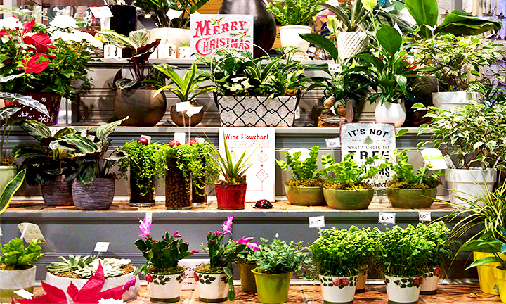

# Js Greens - Greener the world, Healthier the people!
This website is created for the purpose of serving the earth by providing the delivery of plants for free. Our vision is the green world. In today's modern world people do not have any time to grow plants, So our company provides the fully grown plants at no extra cost. Just you need to water them on regular basis and take the benifit. Moreover we also provide plants that are used in treating various health problems. 

### Getting started 
These instructions will get you the copy of project and will also guide you about how to develop and test it. See Deployment for notes on how to deploy the project on your Mac/Pc.

Steps :- 
1. Clone or download zip file of the project in your live system.
2. Extract the files in the folder of your choice.
3. In the folder named Singh_Jaskaran_FIP, open the link of index.html for accessing the first page of website.
4. Templates of all three pages are provided in assets/mmed-1051 as a photoshop files. as well as the logo file is also provided in same folder.

### Prerequistes
To run the index.html file , you will require to install browser such as google chrome or firefox. And for editing the templates you need the licensed software of Adobe Photoshop and Adobe illutrator. 

### Author 
JASKARAN SINGH

### License
The project is copyright of JsGreens@2019 